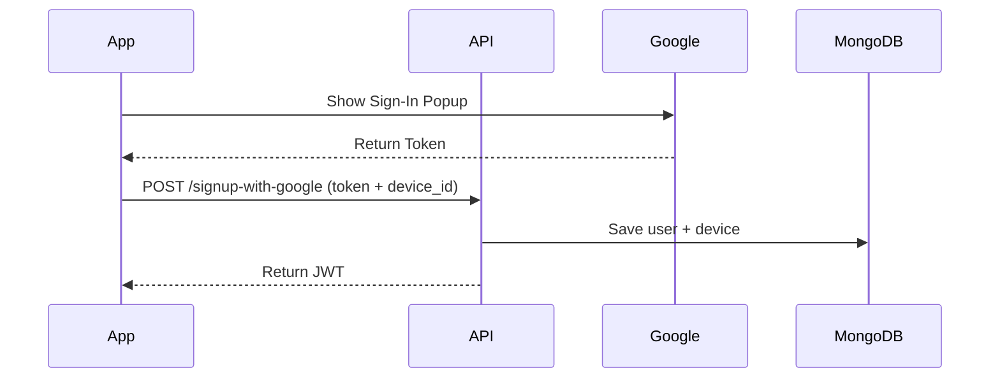

# 🔐 **UniAuth – The Ultimate One-Account-Per-Device Authentication API**  
### *"Eliminate Fake Accounts, Boost Security, and Simplify User Access"*  

**Every company needs UniAuth because:**  
🚀 **User Trust Matters** – Prevent fraud and multi-account abuse in your platform.  
💡 **Seamless UX** – Auto-login users without passwords while keeping security tight.  
🛡️ **Regulatory Ready** – Meet compliance standards (FinTech, Healthcare, E-Learning) with hardware-bound authentication.  

--- 

### **Why UniAuth?**  
✅ **Stop Fake Accounts** – Bind accounts to real devices using **Android ID / iOS Keychain**.  
✅ **Fraud Prevention** – Detect and block emulators, rooted devices, and scripted attacks.  
✅ **Zero Friction** – Users sign in once with **Google OAuth** and never log out.  
✅ **Enterprise-Grade Security** – Built with **JWT, Rate Limiting, and Request Signing**.  

---  

### ✨ **Key Differentiators**  
- **First-to-Market** solution for **1:1 user-device binding** without compromising UX.  
- **Plug-and-Play** – Integrates with any mobile app in <1 hour.  
- **Scalable** – Handles millions of auth requests with FastAPI + MongoDB.  

Now every company can **secure their user base** without complex infrastructure. **Get started today!** 🚀  

  
  
  

---


## 🚀 **Features**  
✅ **Google OAuth Integration** – Easy signup with trusted identities  
✅ **JWT Authentication** – Secure, stateless sessions  
✅ **Device Binding** – Android ID / iOS Keychain UUID enforcement  
✅ **Fraud Prevention** – Stops account sharing and fake users  
✅ **Zero-Logout UX** – Users stay logged in securely  

---

## 🛠️ **Tech Stack**  
| **Layer**       | **Technology**                          |  
|-----------------|----------------------------------------|  
| **Backend**     | FastAPI (Python) + MongoDB             |  
| **Mobile**      | Kotlin (Android) / Swift (iOS)         |  
| **Auth**        | Google OAuth 2.0 + JWT                 |  
| **Security**    | Play Integrity (Android), DeviceCheck (iOS) |  

---

## 📦 **Installation**  
### **Backend Setup**  
```bash  
# Clone the repo  
git clone https://github.com/yourusername/secureauth-api.git  
cd secureauth-api  

# Install dependencies  
pip install -r requirements.txt  

# Run the server  
uvicorn main:app --reload  
```  
*API docs at* `http://localhost:8000/docs`  

### **Mobile Integration**  
1. **Android**:  
   ```kotlin  
   // Add Google Sign-In SDK  
   implementation("com.google.android.gms:play-services-auth:20.7.0")  
   ```  
2. **iOS**:  
   ```swift  
   // Add Google Sign-In pod  
   pod 'GoogleSignIn'  
   ```  

---

## 🔑 **How It Works**  
1. **User signs in via Google** on your mobile app.  
2. **App sends** Google token + device ID to `/signup-with-google`.  
3. **API binds account to the device** in MongoDB.  
4. **Next launch**: Auto-login if device ID matches.  



---

## 🛡️ **Security Highlights**  
- **API Key Protection** – Blocks non-app requests  
- **Rate Limiting** – 5 requests/minute per IP  
- **Request Signing** – Prevents tampering  
- **Device Attestation** – Blocks emulators/rooted devices  

---

## 📜 **License**  
MIT © 2024 Jagdish Patel

---

✨ **Powered by FastAPI & Modern Security Practices** ✨  

--- 

